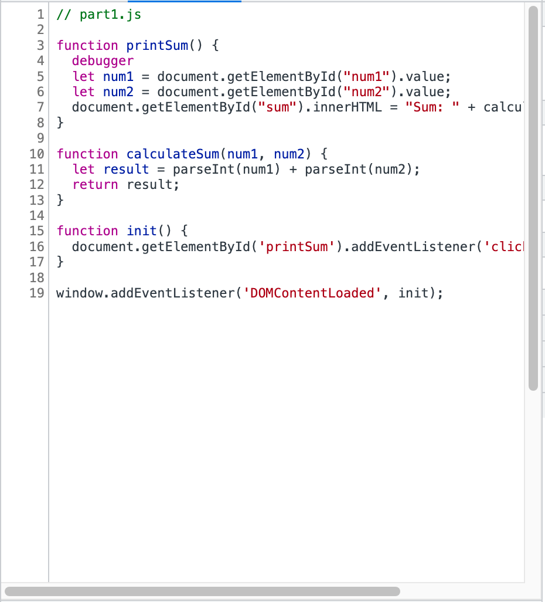

# CSE 110 Lab 4: DevTools Part 2

1. The bug was that num1 and num2 were read as strings and were therefore concatenated instead of actually being added like numbers.
2. To fix the bug, I went into calculateSum and parsed both num1 and num2 into integers individually. That way, they would be treated as numbers instead of strings.
   
